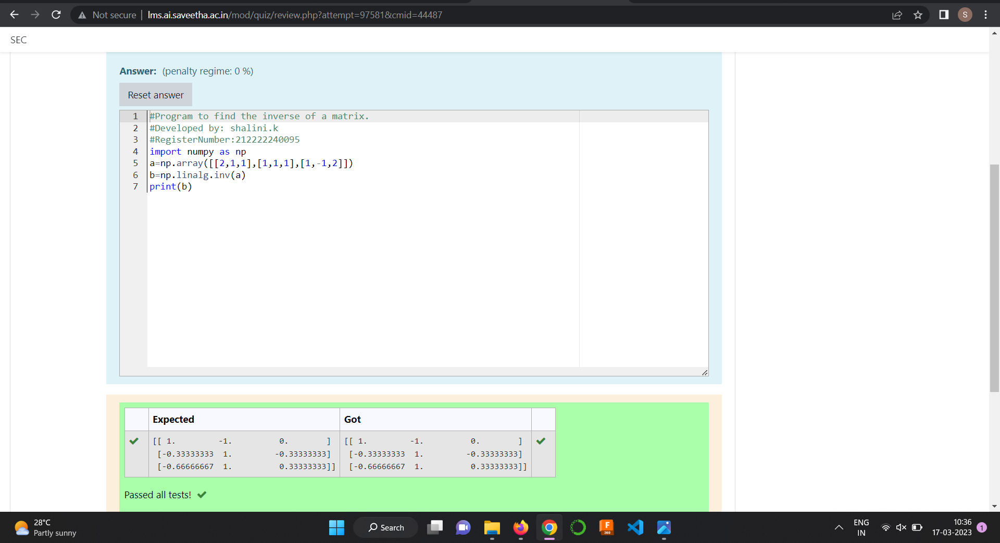

# INVERSE-OF-A-MATRIX
## Aim:
To write a python program to find the inverse of a matrix
## Equipment’s required:
1. 	Hardware – PCs
2. 	Anaconda – Python 3.7 Installation / Moodle-Code Runner
## Algorithm:
### Step1 : 
import the numpy module to use the built-in functions for calculation
### Step 2: 
Prepare the lists from each linear equations and assign in np.array()
### Step 3: 
Using the np.linalg.inv(), we can find the rank of the given matrix
### Step 4: 
End the Program.
## Program:
```
#Program to find the inverse of a matrix.
#Developed by: shalini.k
#RegisterNumber:212222240095
import numpy as np
a=np.array([[2,1,1],[1,1,1],[1,-1,2]])
b=np.linalg.inv(a)
print(b)
```
## Output:

## Result:
Thus the inverse of given matrix is successfully solved using python program

